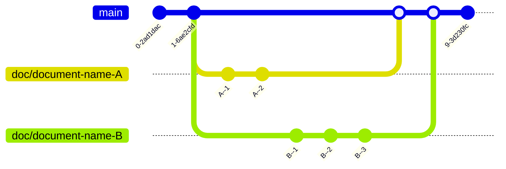

# Byte Maze

## How to can contribute

This is the official repository of [Byte Maze](https://bytemaze.github.io/), a website created with the idea of sharing content about technologies, whether about programming languages, software, technologies, cultures, tips, or any other topic related to the world of technology.

I've always been a fan of collaborative work, so if you feel like contributing some technology-related content, choosing a topic, and developing your idea, you're always welcome here.

**AJ Tech** is a static website built with [Jekyll](https://jekyllrb.com/). All content is generated using [Markdown](https://www.markdownguide.org/). To learn more about this lightweight markup language, you can use this [link](https://daringfireball.net/projects/markdown/syntax#blockquote). So, if you dare to collaborate with this project, you must follow these steps:

> ATTENTION: All content on this website must be written in English. Texts written in another language will not be accepted.

1. To start, you have to create a new branch from the main branch, with the following name: `doc/document-name`
2. You have to create a new markdown file inside the `_posts` folder with the following name: `<publication-date>-<short-name>.md`, and write your article. Learn how to work with this [Jekyll Template](https://chirpy.cotes.page/).
3. After writing your article, you must submit it through a *Pull Request* to be reviewed and approved.

### Complete Workflow



## Working locally

The idea of running the website locally is to test your changes without affecting the online website. If you choose to run locally, you need to clone this repository and follow the same flow described above.

To test your changes locally, you must have these packages installed.

- **Ruby** version 2.5.0 or higher, including all development headers (check your Ruby version using `ruby -v`)
- **RubyGems** (check your Gems version using `gem -v`)
- **GCC** and **Make** (check versions using `gcc -v`, `g++ -v`, and `make -v`)

If you don't have these packages installed or the versions are not as recommended, please update your packages or install them following these instructions:

### Ubuntu

```sh
sudo apt-get install ruby-full build-essential zlib1g-dev
```

Avoid installing RubyGems packages (called gems) as the root user. Instead, set up a gem installation directory for your user account. The following commands will add environment variables to your ~/.bashrc file to configure the gem installation path:

```sh
echo '# Install Ruby Gems to ~/gems' >> ~/.bashrc
echo 'export GEM_HOME="$HOME/gems"' >> ~/.bashrc
echo 'export PATH="$HOME/gems/bin:$PATH"' >> ~/.bashrc
source ~/.bashrc
```

Finally, install Jekyll and Bundler:

```sh
gem install jekyll bundler
```

### MacOs

Please follow these instructions: [Link Here](https://jekyllrb.com/docs/installation/macos/)

### Windows

Please follow these instructions: [Link Here](https://jekyllrb.com/docs/installation/windows/)

### Running locally

Finally, you must run this command at the root of the project.

```sh
bundle exec jekyll serve
```
