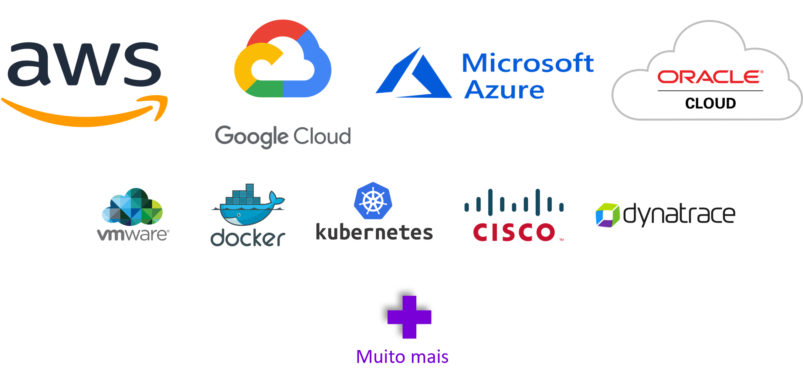

## Terraform, what's this?

Terraform é uma ferramenta de infraestrutura como código (IaC) criada pela Hashicorp, que permite criar, gerenciar e provisionar recursos de infraestrutura cloud ou on-premises de maneira automatizada e consistente.

Uma ferramenta para programação declarativa que usa uma linguagem de alto nível chamada HCL (Hashicorp Configuration Language) e pode gerenciar tanto componentes de baixo nível (ex:. storage), quanto componentes de alto nível (ex:. SaaS).

## Principais caracteristicas do Terraform

* Não há necessidade de instalar uma aplicação, além do binário do Terraform
* Os arquivos do terraform possuem a extensão .tf
* Os plugins são baixados de acordo com as configurações e baixados depois da inicialização do Terraform na pasta .terraform
* Armazena todos os estados do provisionamento da infraestrutura e qualquer modificação que seja sinalizada ao aplicar os códigos em Terraform 

## Composição da arquitetura Terraform

O Terraform Core analisa as configurações e estabelece as dependências entre os recursos.

Os Providers do Terraform servem como intermediários entre o Terraform Core e as APIs correspondentes.

## Componentes do Terraform
#### *Provider*
Terraform Providers são plugins utilizados para interagir e se conectar com um provedor de serviços ou recursos, como provedores de nuvem, provedores de armazenamento, provedores de rede, entre outros. Funcionam como pontes entre o Terraform Core e a API do serviço ou recurso que será provisionado ou gerenciado. Cada provedor é responsável por traduzir as instruções na configuração do Terraform para chamadas apropriadas na API do provedor subjacente.

Alguns Providers necessitam de configurações antes de usá-los. (Ex.: credentials, cloud region, endpoint URL, etc).


Por exemplo, se você estiver usando o Terraform para provisionar recursos na Amazon Web Services (AWS), você precisará do provider AWS. Da mesma forma, se estiver trabalhando com o Microsoft Azure, precisará do provider Azure. Cada provedor possui seus próprios recursos específicos e parâmetros que podem ser configurados no arquivo de configuração do Terraform.

```hcl
Exemplo:

1  provider “aws” {
2    region = “us-east-1”
3  }
```

A estrutura modular do Terraform permite que os usuários escolham e incorporem provedores específicos conforme necessário para atender aos requisitos da infraestrutura que estão criando. Essa abordagem permite uma ampla gama de flexibilidade e suporte para diferentes ambientes e serviços de infraestrutura.



#### *State File*
#### *Backend*

#### *Providers*
#### *Resources*
#### *Data Sources*
#### *Variables*
#### *Output*
#### *Dynamic Block*

#### *FMT*
#### *Validate*
#### *Plan*
#### *Apply*
#### *Destroy*
#### *Refresh*
#### *Import*

#### *Modules*
#### *Functions*

#### *Workspaces*

#### *Provisioners*
