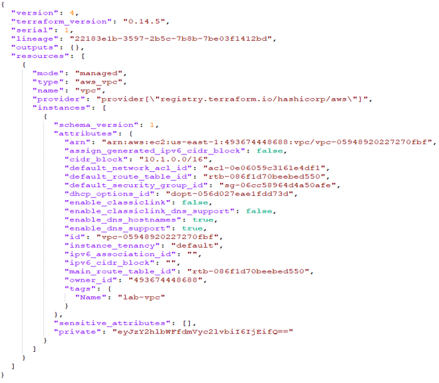
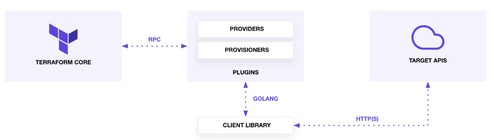
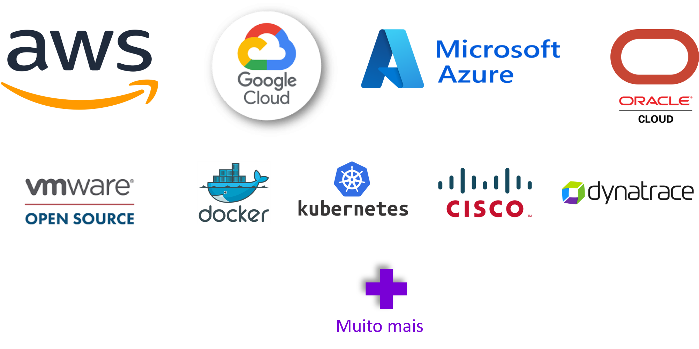

## Terraform, what's this?

Terraform é uma ferramenta de infraestrutura como código (IaC) criada pela Hashicorp, que permite criar, gerenciar e provisionar recursos de infraestrutura cloud ou on-premises de maneira automatizada e consistente.

Uma ferramenta para programação declarativa que usa uma linguagem de alto nível chamada HCL (Hashicorp Configuration Language) e pode gerenciar tanto componentes de baixo nível (ex:. storage), quanto componentes de alto nível (ex:. SaaS).

## Principais caracteristicas do Terraform

* Não há necessidade de instalar uma aplicação, além do binário do Terraform
* Os arquivos do terraform possuem a extensão .tf
* Os plugins são baixados depois da inicialização do Terraform na pasta .terraform, de acordo com as configurações
* Armazena todos os estados do provisionamento da infraestrutura e qualquer modificação que seja sinalizada ao aplicar os códigos em Terraform 

## Composição da arquitetura Terraform

O Terraform Core analisa as configurações e estabelece as dependências entre os recursos.

Os Providers do Terraform servem como intermediários entre o Terraform Core e as APIs correspondentes.

## Componentes do Terraform
### *Backend*
O backend é uma configuração do Terraform que indica onde o statefile será armazenado

Existem maneiras de armazenar o state file, e a escolha vai depender das necessidades e requisitos do projeto.

Local (padrão): O estado é armazenado localmente no sistema de arquivos do computador em que o Terraform está sendo executado. No entanto, isso não é recomendado para ambientes de produção ou colaborativos, pois pode levar a problemas de sincronização e segurança.

Remoto: O estado pode ser armazenado remotamente em um backend, como Amazon S3, Azure Storage, Google Cloud Storage, ou outros. Isso é altamente recomendado para ambientes de produção e equipes colaborativas, pois oferece benefícios como controle de acesso mais granular, capacidade de trabalho colaborativo e maior segurança.

Exemplo de configuração do backend: 

```terraform
1 terraform {
2   backend "s3" {
3     bucket         = "nome-do-seu-bucket-s3"
4     key            = "caminho/para/o/arquivo/terraform.tfstate"
5     region         = "regiao-aws"
6     encrypt        = true
7   }
8 }
```

### *State File*
O estado do Terraform refere-se a um arquivo que rastreia as informações sobre os recursos provisionados, suas configurações e dependências entre eles. Esse arquivo de estado é fundamental para o Terraform entender o estado atual da infraestrutura e determinar quais alterações são necessárias para atingir o estado desejado.

O statefile é essencial para o Terraform por várias finalidades:

Rastreamento de Recursos: O statefile mantém um registro de todos os recursos provisionados pelo Terraform. Ele armazena identificadores únicos, configurações e metadados associados a cada recurso.

Controle de Dependências: O statefile registra as dependências entre os recursos. Isso é crucial para garantir que os recursos sejam criados ou modificados na ordem correta, evitando problemas de dependência.

Concorrência e Bloqueio: O statefile é usado para coordenar operações simultâneas de várias instâncias do Terraform. Ele fornece um mecanismo de bloqueio para garantir que apenas uma instância do Terraform por vez possa modificar o estado.

O importante é garantir que o estado seja gerenciado adequadamente para evitar conflitos e garantir a integridade da infraestrutura gerenciada pelo Terraform.

Exemplo de um statefile:



### *Provider*
Terraform Providers são plugins utilizados para interagir e se conectar com um provedor de serviços ou recursos, como provedores de nuvem, provedores de armazenamento, provedores de rede, entre outros. Funcionam como pontes entre o Terraform Core e a API do serviço ou recurso que será provisionado ou gerenciado. Cada provedor é responsável por traduzir as instruções na configuração do Terraform para chamadas apropriadas na API do provedor subjacente.

Alguns Providers necessitam de configurações antes de usá-los. (Ex.: credentials, cloud region, endpoint URL, etc).



Por exemplo, se você estiver usando o Terraform para provisionar recursos na Amazon Web Services (AWS), você precisará do provider AWS. Da mesma forma, se estiver trabalhando com o Microsoft Azure, precisará do provider Azure. Cada provedor possui seus próprios recursos específicos e parâmetros que podem ser configurados no arquivo de configuração do Terraform.

```hcl
1  provider “aws” {
2    region = “us-east-1”
3  }
```

A estrutura modular do Terraform permite que os usuários escolham e incorporem provedores específicos conforme necessário para atender aos requisitos da infraestrutura que estão criando. Essa abordagem permite uma ampla gama de flexibilidade e suporte para diferentes ambientes e serviços de infraestrutura.


