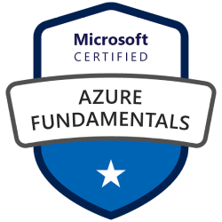
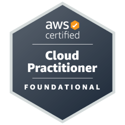
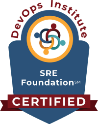
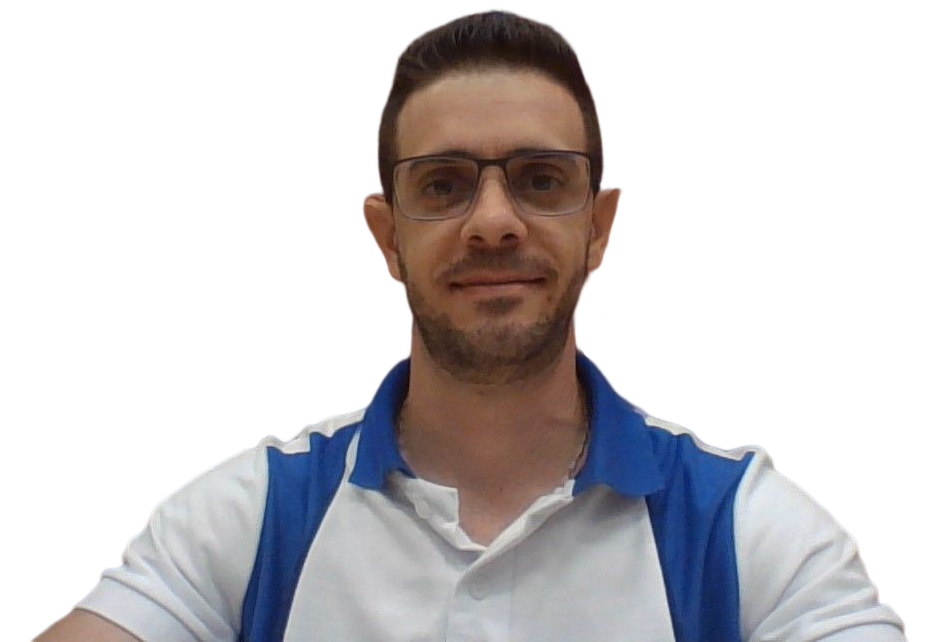

---
# the default layout is 'page'
icon: fas fa-info-circle
order: 4
---

# The website

Not being able to access the information I had on my personal computer from my work computer due to security issues made me think about a solution so this information would be available at all times. The first solution I thought was to use storage from a cloud provider, but again, the policies of the company I work for presented some impediments.

It was here that the idea of creating a website where I could make my work notes available began to grow. When I started developing the website, I thought, why not share other information besides my notes? This is how the project emerged in August 2023, where the idea is to start publishing articles on IT tools, concepts, and foundations.

## Me

I'm a Cuban who decided to leave his land to achieve my dreams and be able to build a professional career that will allow me a better future for myself and my family. I live in Brazil, and since I arrived in this country, I began to understand that collaborative work is one of the best tools in the IT area to grow as a professional, which has awakened my interest in collaborating and helping other people. I'm constantly evolving my knowledge, studying new tools and work methodologies that allow me to adapt to the current market.

Computer engineer with ten years of experience, lover of web development who decided to venture into the world of containers, automation, and everything related to the DevOps culture with which I work today. I have a master's degree in the area of Environmental Acoustics, from the Department of Mechanical Engineering of the Polytechnic School of the University of Sao Paulo.

These are some of the achievements in these almost three years of career as DevOps:

|  |  |  | 

In my free time, I like to share good times with my friends riding a bicycle, I do physical exercises to stay healthy, and I am also an amateur dancer.

{: width="900" height="600"}
_Alejandro de Jongh, 2022_
